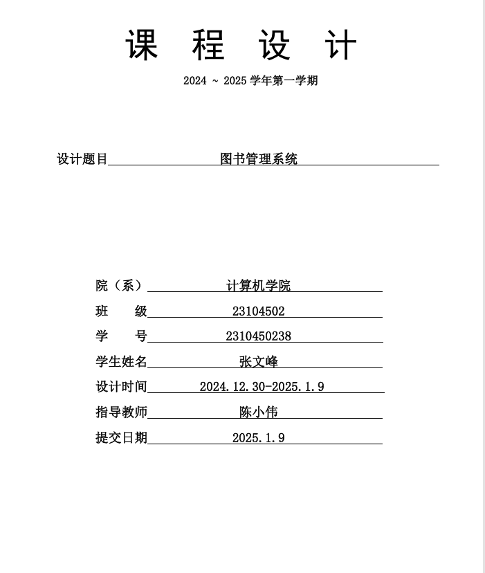
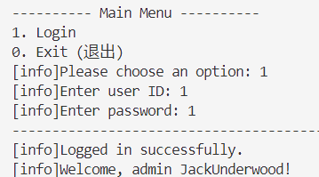
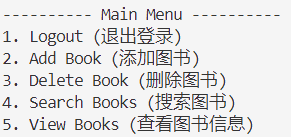
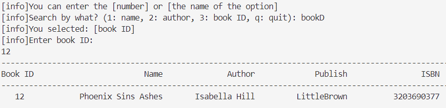
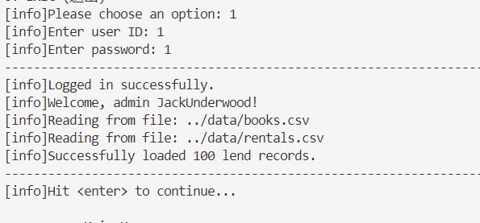
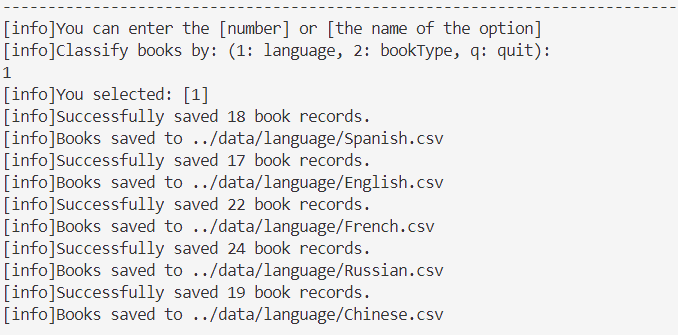
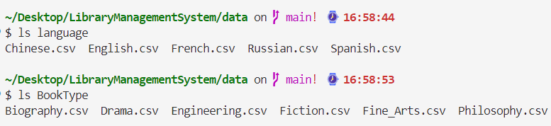
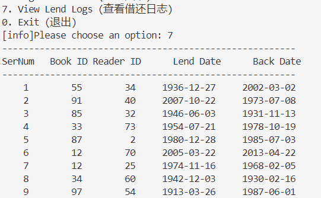

## **实验目的**
1. 实现多用户权限管理的设计与实现。
2. 实现密码登录系统、图书管理和借阅系统的基本功能模块。
3. 实现模糊搜索功能和图书馆分类功能
---

## **实验内容**
本实验设计并实现了一个图书管理系统，针对两类用户——管理员和普通用户，提供不同的权限操作。主要功能模块包括：
1. **用户界面**：显示提示信息
2. **密码登录系统**：用户验证与权限区分。
3. **图书管理系统**：
   - 管理员功能：增删查改书籍，基于LCS的模糊搜索，按语言和类型分类储存书籍,查看借阅的所有记录
   - 普通用户:只能搜索和查看书籍信息
4. **借阅系统**：用户可查询借阅信息

---

## **系统功能描述**
### 1. **密码登录系统**
- **功能描述**：实现用户身份验证与权限区分。
- **实现方法**：
    - 身份验证，通过字符串匹配来验证用户身份，匹配成功则登录，否则失败 
    - 权限区分：user类有一个属性role(admin和user)用于区分用户权限
- **运行效果**：
 
  
- **关键代码**：
    - ```
        std::cout << "[info]Enter user ID: ";
        long long userId;
        std::cin >> userId;
        // enter password
        std::cout << "[info]Enter password: ";
        std::string password;
        std::cin >> password;
        User user = adminManager.validateLogin(userId, password);
        ```
    - ```
        User类
        private:
        long long user_id;    // Unique ID for the user
        std::string username; // Username for login
        std::string password; // User's password
        std::string role;  
        ```
  

### 2. **图书管理系统**
#### 管理员功能
#### 功能1: **增删查改**
- **功能描述** : 管理员可以添加、删除、修改和查询书籍信息。
-  **实现方法**：通过字符串匹配和并编写测试代码来提示用户输入相关信息。
- **运行效果**：
    - 
#### 功能2：**模糊搜索**
- **功能描述**：在搜索或者选择时，即使用户的输入有部分拼写错误或者拼写不完整，系统依旧可以正确识别用户的意图。
- **实现原理**：使用LCS（Longest Common Subsequence，最长公共子序列）算法，实现书籍的模糊查询。
- **运行效果**：
  
- **关键代码**
 
    -  计算`input`和`options`中的字符串的相似度，最后返回与input最为相似的选项.
        ```
        string correctInput(string input, vector<string> options)
        ```
    - 返回两个字符串中最大公共子序列的长度,这个长度时计算两个字符串相似度的指标
    ```
    int longestCommonSubsequence(const std::string &s1, const std::string &s2)
    {
        int len1 = s1.size();
        int len2 = s2.size();
        std::vector<std::vector<int>> dp(len1 + 1, std::vector<int>(len2 + 1));

        // Build the dp table
        for (int i = 1; i <= len1; ++i)
        {
            for (int j = 1; j <= len2; ++j)
            {
                if (s1[i - 1] == s2[j - 1])
                    dp[i][j] = dp[i - 1][j - 1] + 1; 
                else
                    dp[i][j] = std::max(dp[i - 1][j], dp[i][j - 1]); 
            }
        }
        return dp[len1][len2];
    }
    ```
#### 功能3：**分类存储**：
- **功能描述**: 书籍可根据语言和类型进行分类，并支持分类存储。
- **实现原理**:
    - **分类** ：分类标准为book的`language`或者`bookType`属性 
    - **读取和储存**: 使用`stringstream`和`getline`来读取csv,使用`ofstream file(filename);`来储存数据
    - **运行效果**:
        - 
        -  
        - 
    - **关键代码**：
      - `filename`是储存的地址，`books`为储存的内容，
        ```
        void BookManager::saveData(string filename, vector<Book> books)
        ```
    -   根据书籍的语言或者类型来分类
        ```
        void BookManager::classifyByLanguage()
        void BookManager::classifyByBookType()
        ```
    - 创建分类的目录和文件
       ```
        string folder = "../data/language/";
        string command = "mkdir -p " + folder;
        system(command.c_str()); // create the folder
       ``` 
### **普通用户功能**
- **查询书籍**：普通用户的权限少，仅仅可以查看书籍详情，支持模糊查询。


### 3. **借阅系统**
- **借阅功能**：查看借阅历史。。
- **运行效果**：
    - 
-  **关键代码**：
    - 借阅历史里储存的单位
    ```
    struct LendList {
        long long ser_num;
        long long book_id;
        long long reader_id;
        std::string lend_date;
        std::string back_date;

        void display() const;
    };
    ```
---

## **系统设计**
### 1. **系统架构**
系统主要分为**三个核心功能模块**：**图书管理模块**（Book Management）、**用户管理**模块（User Management）、和**借阅管理模块**（Lend Management），并由一个总的管理类（AdminManager）协调这些模块。
#### **主要模块**
1. **图书管理模块**
    - **文件**: `Book.h`, `Book.cpp`, `BookManager.h`, `BookManager.cpp` 
    - **核心职责**:
        - 负责书籍的增删查改功能。
        - 实现模糊搜索功能（可能基于LCS算法）。
        - 支持书籍按语言和类型分类存储（`classifyByLanguage` 和 `classifyByBookType` 方法）。
        - 提供书籍组织（organize）功能以优化存储结构。 
2. **用户管理模块**
    - **文件**: `User.h`, `User.cpp`, `UserManager.h`, `UserManager.cpp` 
    - **核心职责**:
        - 负责用户的数据管理，包括用户数据加载和保存。
        - 验证用户的登录信息（`validateLogin` 方法）。
        - 区分管理员和普通用户的操作权限。 
3. **借阅管理模块**
    - **文件**: `LendManager.h`, `LendManager.cpp` 
    - **核心职责**:
        - 处理书籍的借阅与归还功能（`lendBook` 和 `returnBook` 方法）。
        - 记录和查看借阅日志（`viewLendLogs` 方法）。
        - 支持借阅记录的加载和保存。  


#### **核心模块**
- **文件** : `AdminManager.h`, `AdminManager.cpp`
- **核心职责**:
    - 作为系统的主控制器，整合和调用图书管理、用户管理、和借阅管理模块的功能。
    - 提供接口供管理员使用，包括书籍管理、用户登录验证、和借阅记录查看。  
    
## **数据库设计**
您的数据库由三张主要表组成，分别是 **用户表（users.csv）**、**书籍表（books.csv）** 和 **借阅记录表（rentals.csv）**。以下是它们的详细描述：

---

### **1. 用户表（users.csv）**
- **用途**: 记录用户的基本信息和角色权限，用于身份验证和权限管理。
- **字段说明**:
  | 字段名      | 数据类型       | 描述                              |
  |-------------|----------------|-----------------------------------|
  | `user_id`   | 整数（Primary Key） | 用户唯一标识符                   |
  | `username`  | 字符串         | 用户名                            |
  | `password`  | 字符串         | 用户密码（可以存储哈希值以提高安全性） |
  | `role`      | 字符串         | 用户角色（如管理员 `admin` 或普通用户 `user`） |

---

### **2. 书籍表（books.csv）**
- **用途**: 存储书籍的详细信息，包括基本属性、分类、库存等。
- **字段说明**:
  | 字段名       | 数据类型       | 描述                              |
  |--------------|----------------|-----------------------------------|
  | `book_id`    | 整数（Primary Key） | 书籍唯一标识符                   |
  | `name`       | 字符串         | 书籍名称                          |
  | `author`     | 字符串         | 作者名称                          |
  | `publish`    | 字符串         | 出版社名称                        |
  | `ISBN`       | 字符串         | 国际标准书号                      |
  | `language`   | 字符串         | 书籍语言（如中文、英文等）          |
  | `price`      | 浮点数         | 书籍价格                          |
  | `pub_date`   | 日期           | 出版日期                          |
  | `class`      | 字符串         | 书籍类别（如小说、技术、历史等）     |
  | `quantity`   | 整数           | 库存数量                          |

---

### **3. 借阅记录表（rentals.csv）**
- **用途**: 存储用户的借阅记录，包括借书时间和归还状态。
- **字段说明**:
  | 字段名       | 数据类型       | 描述                              |
  |--------------|----------------|-----------------------------------|
  | `rental_id`  | 整数（Primary Key） | 借阅记录唯一标识符                |
  | `book_id`    | 整数（Foreign Key） | 对应的书籍 ID，关联书籍表         |
  | `user_id`    | 整数（Foreign Key） | 借阅用户的 ID，关联用户表         |
  | `rent_date`  | 日期           | 借阅日期                          |
  | `return_date`| 日期或 NULL    | 归还日期（未归还则为 NULL）        |

---
